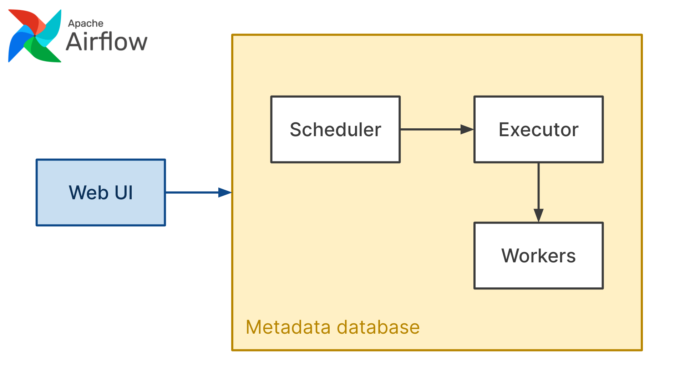
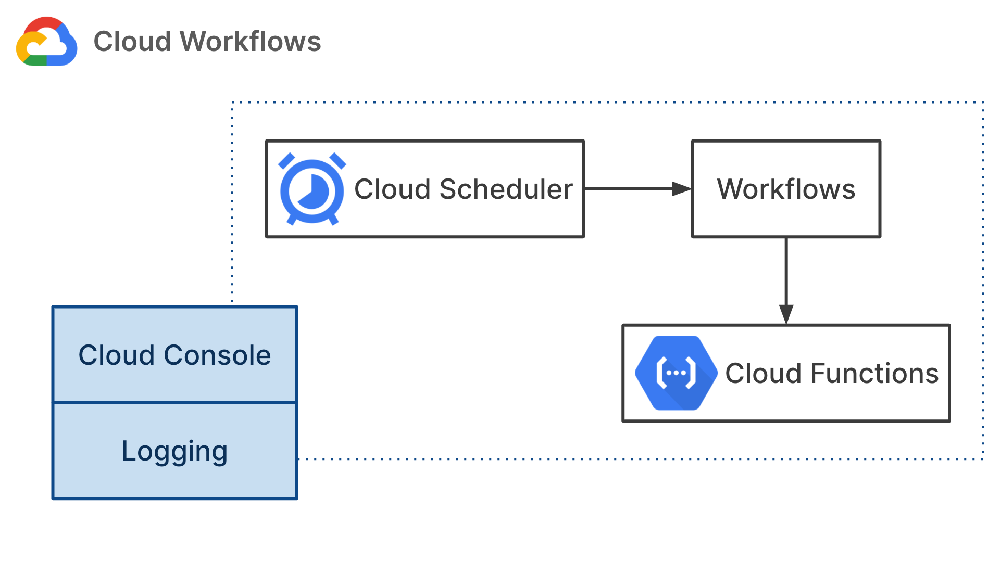
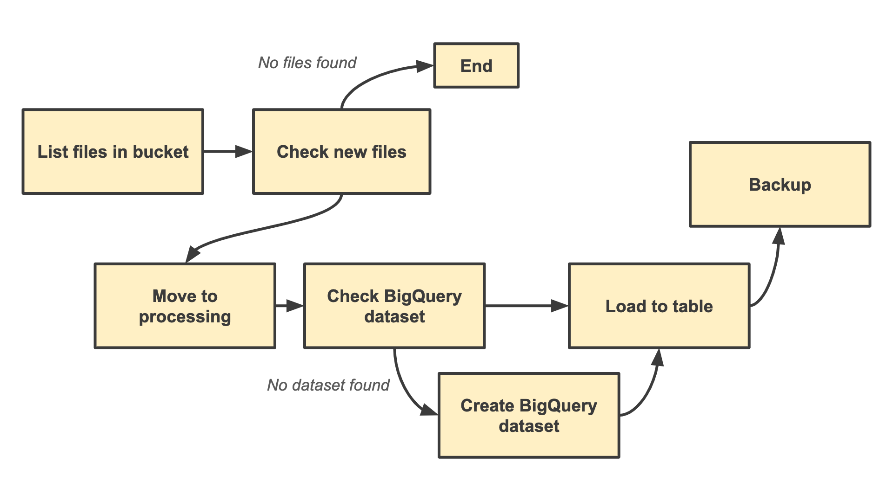

# Serverless Workflows on Google Cloud

Source code for "Creating a fully serverless workflow management platform" talk from [ServerlessDays Virtual](https://virtual.serverlessdays.io/) by Alexandra Abbas.

* [Presentation slides](https://docs.google.com/presentation/d/1PaQQgJTAFKg4dxxost9qJsIKZ_2LqSootdgKT2XAf4k/edit?usp=sharing)
* [YouTube video](https://www.youtube.com/channel/UCYzAnR_SebAmLRkKIbK_YoQ)

_Credit: This presentation was inspired by a [Reddit post from wil19558](https://www.reddit.com/r/ETL/comments/iluazc/gcp_workflows_seemingly_newly_added_serverless/)_

## 📚 Concepts

A workflow management platform allows you to write, organise, execute, schedule and monitor workflows. A workflow is a collection of data processing setps that could form an ETL (Extract-Transform-Load) pipeline or a Machine Learning pipeline.

With the release of [Workflows](https://cloud.google.com/workflows/docs) on Google Cloud it became possible to create a fully serverless workflow manager which is easier to maintain and has a lower cost than other self-hosted or managed services like [Apache Airflow](https://airflow.apache.org/) or [Luigi](https://github.com/spotify/luigi). Workflows could be a good alternative if you have to manage only a few pipelines.

To create a serverless workflow manager we could basically copy the architecture of Apache Airflow replacing Airflow's components with serverless alternatives. Main components of Apache Airflow are the web server, scheduler, executor, metadata database and workers.



We could use [Cloud Scheduler](https://cloud.google.com/scheduler/docs) as the scheduler component which is responsible for triggering workflows at the right time. Google Cloud's new service, [Workflows](https://cloud.google.com/workflows/docs) can serve as the executor which manages the steps in a workflow and triggers workers to run tasks. We could think of [Cloud Functions](https://cloud.google.com/functions/docs) as workers which are responsible for actually running tasks.

In a serverless setup we don't need a metadata datasbase. In Airflow metadata database is basically a shared state that all components can read from and write to. In a serverless architecture if we would like to share data between components we need to send that data as a JSON string (request body) when calling that component. Think of each component as a stateless API.



I compared these two architectures in my presentation. Have a look at the [presentation slides](https://docs.google.com/presentation/d/1PaQQgJTAFKg4dxxost9qJsIKZ_2LqSootdgKT2XAf4k/edit?usp=sharing) for details.

_P.S. I didn't mention in my presentation although it's quite important that Cloud Functions have a 540s timeout. Which means that data processing jobs which take longer than that would fail. In that case I recommend using [App Engine](https://cloud.google.com/appengine/docs) instead of Cloud Functions._

## 🚛 Use case

Let's imagine that we're working for a logistics company. This company has vehicles equiped with sensors. These sensors collect data about the state of each vehicle, they send CSV files to Cloud Storage every hour.

Our task is to take the CSV files in Cloud Storage and load all files into a table in BigQuery so analysts and data scientists can access historical data.



## 🛠 Setup

### Create resources

Create the following resources in Google Cloud in order to run this project.

* Create a Google Cloud project
* Create a Cloud Storage bucket
* Create 3 "folders" called _landing_, _processing_ and _backup_ in your Cloud Storage bucket

Take note of your project ID, bukcet name and region as we're going to use these later. Alternatively export these variables as environment variables.

```bash
export PROJECT=<your-project-name>
export BUCKET=<your-bucket-name>
export REGION=<your-bucket-region>
```
Set the project that you just created as your default project using the gcloud command line tool.

```bash
gcloud config set project ${PROJECT}
```

### Enable APIs

Run the following command to enable Cloud Functions, Workflows, Cloud Build and Cloud Storage APIs.

```bash
gcloud services enable \
    cloudfunctions.googleapis.com \
    workflows.googleapis.com \
    cloudbuild.googleapis.com \
    storage.googleapis.com
```

## Upload data files to bukcet

Upload sample CSV files to your storage bucket.

```bash
cd data/
gsutil cp *.csv gs://${BUKCET}/landing
```

## 📤 Deploy Cloud Functions

This repository includes 3 Cloud Functions. These functions contain the business logic corresponding to steps in our workflow.

* `list_files`: Lists file names in a bucket or in a "folder" of a bucket
* `move_files`: Renames prefixes of objects in a bucket (moves object from one "folder" to another in a bucket)
* `load_files`: Loads files from Cloud Storage into a BigQuery table

Each function has its own directory. Change to that directory and deploy each function using the following command.

```bash
cd list_files/
gcloud functions deploy list_files \
    --runtime python37 \
    --trigger-http \
    --allow-unauthenticated \
    --region=${REGION}
```
Run the same command for each function.

## 📤 Deploy workflow

Our workflow is defined in `bigquery_data_load.yaml` file. Workflows require you to write your pipelines in YAML. I recommend reviewing the [syntax reference](https://cloud.google.com/workflows/docs/reference/syntax) for writing YAML workflows. Let's deploy our worlfow by running the following command. You cannot deploy your workflow to any region, make sure that the region you're using is supported by Workflows.

```bash
gcloud beta workflows deploy bigquery_data_load \
    --source=bigquery_data_load.yaml \
    --region=${REGION}
```

You can execute your workflows manually either via the UI or command line. To execute your workflow via the command line, run the following command.

```bash
gcloud beta workflows execute bigquery_data_load \
	--location=${REGION} \
	--data='{"bucket":"<your-bucket-name>","project":"<your-project-name>","region":"<your-bucket-region>"}'
```

## ⏰ Schedule workflow

### Create Service Account for Cloud Scheduler

Let's create a Service Account for Cloud Scheduler which will be responsible for triggering workflows.

```bash
export SERVICE_ACCOUNT=scheduler-sa
gcloud iam service-accounts create ${SERVICE_ACCOUNT}
gcloud projects add-iam-policy-binding ${PROJECT} \
    --member="serviceAccount:${SERVICE_ACCOUNT}@${PROJECT}.iam.gserviceaccount.com" \
    --role="roles/workflows.invoker"
```

### Create Cloud Scheduler job

Let's create a job in Cloud Scheduler which will trigger our workflow once every hour. This job will use the service account we've just created. We also specify a request body which will contain input arguments for our workflow.

```bash
gcloud scheduler jobs create http bigquery_data_load_hourly \
    --schedule="0 * * * *" \
    --uri="https://workflowexecutions.googleapis.com/v1beta/projects/${PROJECT}/locations/${REGION}/workflows/bigquery_data_load/executions" \
    --oauth-service-account-email="${SERVICE_ACCOUNT}@${PROJECT}.iam.gserviceaccount.com" \
    --message-body='{"bucket":"<your-bucket-name>","project":"<your-project-name>","region":"<your-bucket-region>"}'
```

## 👀 Monitor workflows

You can monitor your workflows via Google Cloud Consolse. Unfortunately Google Cloud Console doesn't generate any visual graph of your workflows yet. You can assess all logs in Workflows and Cloud Functions UI, these logs allow you to configure metrics, alerts and build monitoring bashboards.
